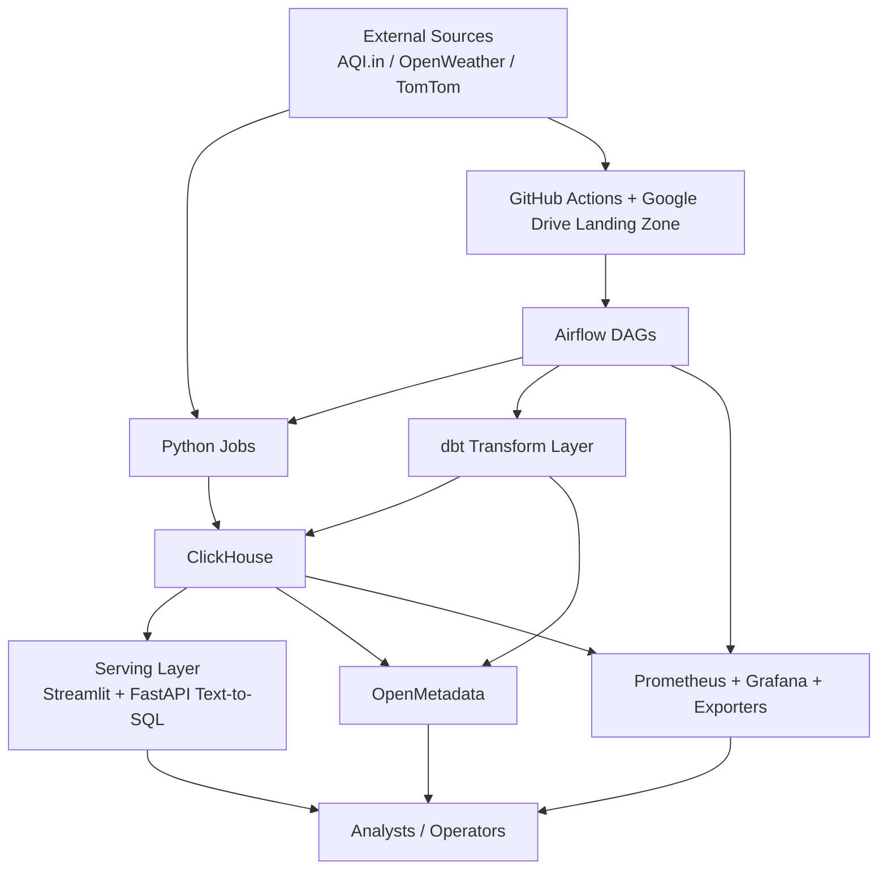

<!-- generated-by: gsd-doc-writer -->
# Architecture

## System Overview

The Vietnam Air Quality Data Platform is a containerized, batch-oriented analytics system built around ClickHouse as the serving warehouse, Apache Airflow as the sync/transform orchestrator, dbt as the transformation layer, and Streamlit plus an internal FastAPI service as the user-facing query layer. Its primary inputs are external air-quality, weather, and traffic sources (`AQI.in`, `OpenWeather`, `TomTom`) collected by GitHub Actions into a Google Drive landing zone; its primary outputs are ClickHouse marts, the Streamlit analytics dashboard, the guarded Ask Data text-to-SQL workflow, OpenMetadata catalog/lineage assets, and Prometheus/Grafana operational telemetry. Architecturally, the repository is layered: ingestion, warehouse modeling, serving interfaces, and metadata/monitoring services.

## Component Diagram



### Major Components

- `airflow/dags/dag_sync_gdrive.py` is the primary Airflow entrypoint for the checked-in ingestion path: it bridges Google Drive landing-zone files into ClickHouse raw tables and triggers downstream transforms when new files arrive.
- `airflow/dags/dag_ingest_hourly.py` remains as a manual legacy fallback for direct Airflow-driven ingestion, but it is not the source-of-truth trigger path.
- `python_jobs/jobs/` contains source-specific collectors for AQI.in, OpenWeather, TomTom, Google Drive sync, and OpenMetadata bootstrap tasks.
- `dbt/dbt_tranform/` converts raw warehouse tables into staged, intermediate, and mart-layer models, then emits `manifest.json`, `catalog.json`, and `run_results.json`.
- `python_jobs/dashboard/` is the interactive Streamlit dashboard that reads `dm_*` and `fct_*` models from ClickHouse.
- `python_jobs/text_to_sql/` is an internal FastAPI service that generates SQL, validates it against a mart-only contract, and executes it with a read-only ClickHouse client.
- `openmetadata/` and `python_jobs/jobs/openmetadata/` together provide metadata ingestion configs plus glossary/governance bootstrap code.
- `monitoring/` provisions Prometheus, Grafana, alerting rules, and custom exporters for runtime observability.

## Data Flow

1. **Source acquisition**
   `.github/workflows/scheduled_ingestion.yml` is the source-of-truth ingestion workflow. It is triggered externally by Google Apps Script, then runs the AQI.in, OpenWeather, and traffic collectors with `INGEST_MODE=csv`, producing landing-zone CSV files on a GitHub Actions runner before uploading them to Google Drive.

2. **Raw persistence**
   The ingestion jobs obtain a writer from `get_data_writer()` in `python_jobs/common/writer_factory.py`. For the production ingest path they emit CSV files to the landing zone; the direct ClickHouse writer remains available for local or legacy/manual runs.

3. **Landing-zone sync**
   `dag_sync_gdrive()` downloads new files from Google Drive, maps folder paths to target raw tables, inserts them into ClickHouse, and only triggers downstream transforms if new data was synchronized.

4. **Transformation and test execution**
   `dag_transform()` runs `dbt deps`, `dbt seed`, `dbt run` for `staging`, `intermediate`, and `marts`, followed by `dbt test` and `dbt docs generate`. The dbt project is explicitly layered in `dbt_project.yml`, with staging models materialized as tables and downstream layers materialized incrementally.

5. **Model unification**
   The intermediate layer merges source-specific measurements into common structures. For example, `int_core__measurements_unified.sql` unions AQI.in and OpenWeather measurements, applies source weighting and calibration, and enriches each record with Vietnamese regional dimensions before downstream marts consume it.

6. **Serving-model construction**
   Core and analytics marts build query-ready warehouse tables such as `fct_aqi_weather_traffic_unified.sql` and the `dm_air_quality_*` models. These marts join air quality, weather, traffic, and administrative dimensions into dashboard-facing and text-to-SQL-facing datasets.

7. **User query path**
   The Streamlit app (`python_jobs/dashboard/app.py`) renders multiple analytics pages and queries ClickHouse through dashboard library code. The Ask Data page calls the internal FastAPI service; that service uses `VannaRuntime` to generate SQL, `validate_sql()` to enforce the mart-only contract, issues a preview token, and executes only preview-approved SQL through `ClickHouseExecutor`.

8. **Metadata and governance**
   After dbt runs produce artifacts, OpenMetadata ingests warehouse objects and dbt lineage from the shared `dbt-target` volume. `dag_openmetadata_curation()` separately runs `setup_governance.py` and `setup_glossary.py` so dbt-owned domains, owners, and glossary terms resolve in the catalog.

9. **Observability**
   Prometheus scrapes ClickHouse, PostgreSQL, node, and container metrics; Grafana provisions dashboards and alerting from repo-managed configuration. This keeps operational monitoring separate from the analytical serving path while still observing Airflow, warehouse, and host/container health.

## Key Abstractions

| Abstraction | Location | Purpose |
| --- | --- | --- |
| `dag_ingest_hourly()` | `airflow/dags/dag_ingest_hourly.py` | Manual legacy fallback for direct source ingestion. |
| `dag_sync_gdrive()` | `airflow/dags/dag_sync_gdrive.py` | Primary sync DAG that bridges Google Drive landing-zone files into ClickHouse raw tables. |
| `dag_transform()` | `airflow/dags/dag_transform.py` | Warehouse build pipeline for `dbt deps`, `seed`, layered runs, tests, docs generation, and artifact patching. |
| `APIClient` | `python_jobs/common/api_client.py` | Shared retrying HTTP client used by ingestion jobs to talk to external providers. |
| `TokenManager` | `python_jobs/common/token_manager.py` | Multi-token rotation and per-token rate-limit management for high-throughput API ingestion. |
| `DataWriter` / `get_data_writer()` | `python_jobs/common/base_writer.py`, `python_jobs/common/writer_factory.py` | Write abstraction that switches between ClickHouse persistence and CSV output depending on runtime mode. |
| `ClickHouseWriter` | `python_jobs/common/clickhouse_writer.py` | Batch insert implementation for raw table ingestion, including retry and batch-id decoration. |
| `update_control()` | `python_jobs/common/ingestion_control.py` | Writes the latest run state and latest successful-run timestamp for ingest/transform pipeline steps into `ingestion_control`. |
| `VannaRuntime` | `python_jobs/text_to_sql/vanna_runtime.py` | SQL-generation boundary for Ask Data; trains Vanna on the approved mart catalog but does not execute SQL. |
| `validate_sql()` | `python_jobs/text_to_sql/sql_validator.py` | Contract gate that rejects non-`SELECT` queries, non-allowlisted tables, and raw/staging/intermediate access. |
| `ClickHouseExecutor` | `python_jobs/text_to_sql/clickhouse_executor.py` | Read-only execution boundary that adds row caps and timeout settings to approved Ask Data queries. |

## Directory Structure Rationale

The repository keeps orchestration, source collection, warehouse modeling, serving interfaces, and operational infrastructure in separate top-level directories because each layer has a different runtime, lifecycle, and deployment boundary.

```text
airflow/         DAG definitions, Airflow image/config, and mounted runtime directories for orchestration
dbt/             ClickHouse transformation project with macros, seeds, staging, intermediate, and mart models
python_jobs/     Shared ingestion libraries, source collectors, Streamlit dashboard, and FastAPI text-to-SQL service
monitoring/      Prometheus scrape/rule config, Grafana provisioning, and the custom Docker stats exporter
openmetadata/    Catalog ingestion configs, custom connectors, and local OpenMetadata persistence mounts
tests/           Cross-cutting Python tests for Airflow, common utilities, ingestion jobs, and models
scripts/         Bootstrap and operational scripts such as ClickHouse initialization
docs/            Project documentation maintained alongside the implementation
postgres/        PostgreSQL initialization scripts for the shared Airflow/OpenMetadata metadata store
data/            Static supporting datasets such as OSM-derived inputs used by traffic enrichment
```

Additional stateful directories such as `clickhouse-data/`, `airflow/data/`, `airflow/logs/`, `openmetadata/elasticsearch-data/`, and `logs/` exist to back Docker volumes and local runtime state rather than to define application logic. Keeping them outside the main source directories helps preserve a clean separation between code, declarative infrastructure, and mutable local data.
